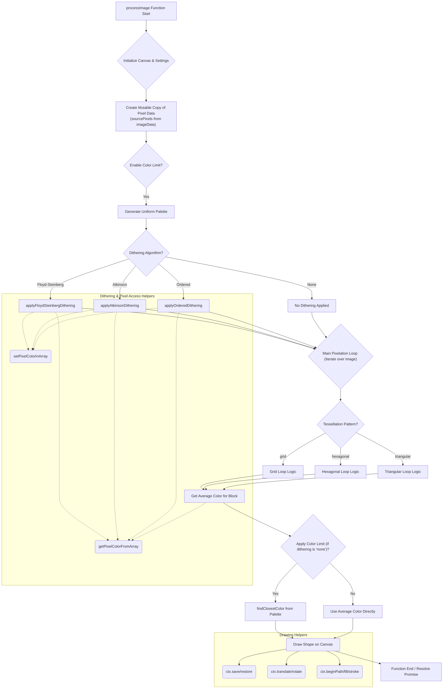

# Pixelator App: Technical Documentation

This document provides a deeper dive into the architecture and core functionalities of the Pixelator App, focusing on the `processImage` function, which is the heart of the pixelation logic.

---

## 📦 Project Structure

The application is structured into several modular JavaScript files to enhance readability, maintainability, and separation of concerns:

- `index.html`: The main HTML structure of the application.
- `style.css`: Contains all the styling for the user interface.
- `script.js`: The main application logic, handling UI interactions, image loading, and orchestrating the pixelation process.
- `ui.js`: Manages DOM element references and provides utility functions for updating the user interface.
- `process.js`: Contains the core `processImage` function and general image processing helpers (color quantization, dithering, `drawShape`).
- `pattern_grid.js`: Implements the drawing logic for the "Grid" tessellation pattern.
- `pattern_hexagonal.js`: Implements the drawing logic for the "Hexagonal" tessellation pattern.
- `pattern_triangular.js`: Implements the drawing logic for the "Triangular" tessellation pattern.
- `generateSVG.js`: Handles the generation of SVG output from the processed image data.
- `stats.js`: Manages the display and updates of performance statistics.

---

## 🧠 Core Logic: `processImage` Function

The `processImage` function (located in `process.js`) is central to the application. It takes the raw image data and user-defined settings, then orchestrates the entire pixelation pipeline.

Here's a detailed flowchart illustrating its execution flow:

## Flow Breakdown:

### Initialization (A, B):

The function begins by receiving the Canvas 2D context (ctx), the ImageData object (which already includes any applied margin), and the user settings.
The canvas dimensions are set to match the imageData dimensions, and the background is filled with the user-selected backgroundColor.

### Pixel Data Preparation (C):

A mutable Uint8ClampedArray (sourcePixels) is created from the imageData.data. This copy allows dithering algorithms to modify pixel values without affecting the original ImageData object directly, ensuring clean error propagation.

### Color Limiting & Palette Generation (D, E):

If enableColorLimit is true, a uniform palette is generated based on the numColors setting. This palette contains the target colors for quantization.

### Dithering Application (F, G, H, I, J):

If color limiting is enabled and a dithering algorithm (floyd-steinberg, atkinson, or ordered) is selected, the corresponding dithering function is applied. These functions modify the sourcePixels array in place, spreading quantization errors to adjacent pixels to simulate a wider range of colors. If "None" is selected, no dithering occurs.
Helper Functions: getPixelColorFromArray and setPixelColorInArray are crucial here, providing safe and efficient pixel access and modification within the sourcePixels array.

### Main Pixelation Loop (K):

The core of the pixelation process involves iterating over the image, dividing it into blocks based on the pixelDensity and tessellationPattern.

### Tessellation Pattern Logic (L, M, N, O):

Based on the tessellationPattern setting (grid, hexagonal, triangular), the control is passed to a dedicated drawing function (drawGrid, drawHexagonal, drawTriangular). These functions handle the specific geometry and iteration logic for their respective patterns.

### Average Color Calculation (P):

Within each pattern's loop, getAverageColorForBlock is called. This helper function samples the sourcePixels within the current block (defined by the pattern's geometry) to determine the average color of that area.

### Final Color Quantization (Q, R, S):

If enableColorLimit is true AND dithering is set to "None", the findClosestColor function is used to snap the average color to the nearest color in the activePalette. If dithering was applied, this step is skipped as the sourcePixels already contain dithered (quantized) colors.

### Shape Drawing (T):

The drawShape function is called to render the pixel block on the main canvas. It takes the calculated color, pixelDensity, vectorShape, shapeRotation, and outline settings to draw the appropriate geometric shape.
Drawing Helpers: ctx.save/restore, ctx.translate/rotate, and ctx.beginPath/fill/stroke are fundamental Canvas API methods used by drawShape to manage drawing states and render shapes efficiently.

### Function End (U):

Once all pixel blocks are drawn, the processImage function resolves its promise, returning information such as the finalColorCount and detailedTimings for performance analysis.

This modular design ensures that each part of the pixelation process is encapsulated and manageable, contributing to a robust and extensible application.
