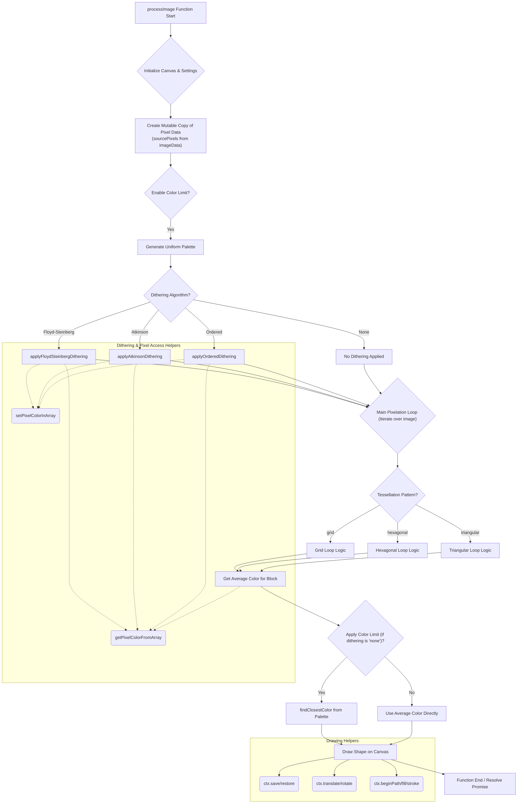

# Pixelator App: Technical Documentation

This document provides a deeper dive into the architecture and core functionalities of the Pixelator App, focusing on the `processImage` function, which is the heart of the pixelation logic.

---

## 📦 Project Structure

The application is structured into several modular JavaScript files to enhance readability, maintainability, and separation of concerns:

- `index.html`: The main HTML structure of the application.
- `style.css`: Contains all the styling for the user interface.
- `script.js`: The main application logic, handling UI interactions, image loading, and orchestrating the pixelation process.
- `ui.js`: Manages DOM element references and provides utility functions for updating the user interface.
- `process.js`: Contains the core `processImage` function and general image processing helpers (color quantization, dithering, `drawShape`).
- `pattern_grid.js`: Implements the drawing logic for the "Grid" tessellation pattern.
- `pattern_hexagonal.js`: Implements the drawing logic for the "Hexagonal" tessellation pattern.
- `pattern_triangular.js`: Implements the drawing logic for the "Triangular" tessellation pattern.
- `generateSVG.js`: Handles the generation of SVG output from the processed image data.
- `stats.js`: Manages the display and updates of performance statistics.

---

## 🧠 Core Logic: `processImage` Function

The `processImage` function (located in `process.js`) is central to the application. It takes the raw image data and user-defined settings, then orchestrates the entire pixelation pipeline.

Here's a detailed flowchart illustrating its execution flow:

## Flow Breakdown: Advanced Pixelator App

This document outlines the step-by-step process of how the pixelator app transforms an image based on user settings.

### Initialization (A, B)

The function starts by taking in the **Canvas 2D context** (`ctx`), the **ImageData** object (which already includes any applied margin), and the user's **settings**. The canvas dimensions are then set to match the `imageData`, and the background is filled with the user-selected `backgroundColor`.

### Pixel Data Preparation (C)

A **mutable `Uint8ClampedArray` (`sourcePixels`)** is created from `imageData.data`. This copy is crucial because it allows dithering algorithms to modify pixel values directly without altering the original `ImageData` object, ensuring clean error propagation.

### Color Limiting & Palette Generation (D, E)

If `enableColorLimit` is `true`, a **uniform color palette** is generated based on the `numColors` setting. This palette contains the target colors for the quantization process.

### Dithering Application (F, G, H, I, J)

If color limiting is enabled and a dithering algorithm (`floyd-steinberg`, `atkinson`, or `ordered`) is chosen, the corresponding **dithering function** is applied. These functions modify the `sourcePixels` array in place, effectively spreading quantization errors to neighboring pixels to simulate a broader range of colors. If "None" is selected, no dithering occurs. Helper functions like `getPixelColorFromArray` and `setPixelColorInArray` are vital here for safe and efficient pixel access and modification within the `sourcePixels` array.

---

### Main Pixelation Loop (K)

The core of the pixelation process involves iterating over the image, dividing it into smaller blocks based on the `pixelDensity` and `tessellationPattern`.

### Tessellation Pattern Logic (L, M, N, O)

Depending on the chosen `tessellationPattern` (e.g., `grid`, `hexagonal`, `triangular`), control is passed to a **dedicated drawing function** (like `drawGrid`, `drawHexagonal`, `drawTriangular`). Each of these functions handles the specific geometry and iteration logic for its respective pattern.

### Average Color Calculation (P)

Within each pattern's loop, `getAverageColorForBlock` is called. This helper function samples the `sourcePixels` within the current block (defined by the pattern's geometry) to determine the **average color** of that specific area.

### Final Color Quantization (Q, R, S)

If `enableColorLimit` is `true` AND dithering is set to "None", the `findClosestColor` function is used to snap the average color to the **nearest color in the `activePalette`**. If dithering was already applied, this step is skipped because the `sourcePixels` already contain the dithered (quantized) colors.

### Shape Drawing (T)

The `drawShape` function is then called to render the pixel block onto the main canvas. It uses the calculated color, `pixelDensity`, `vectorShape`, `shapeRotation`, and any outline settings to draw the appropriate **geometric shape**. Drawing helpers like `ctx.save`/`restore`, `ctx.translate`/`rotate`, and `ctx.beginPath`/`fill`/`stroke` are fundamental Canvas API methods used by `drawShape` to manage drawing states and render shapes efficiently.

### Function End (U)

Once all pixel blocks are drawn, the `processImage` function **resolves its promise**, returning important information such as the `finalColorCount` and `detailedTimings` for performance analysis. This modular design ensures that each part of the pixelation process is encapsulated and manageable, contributing to a robust and extensible application.
