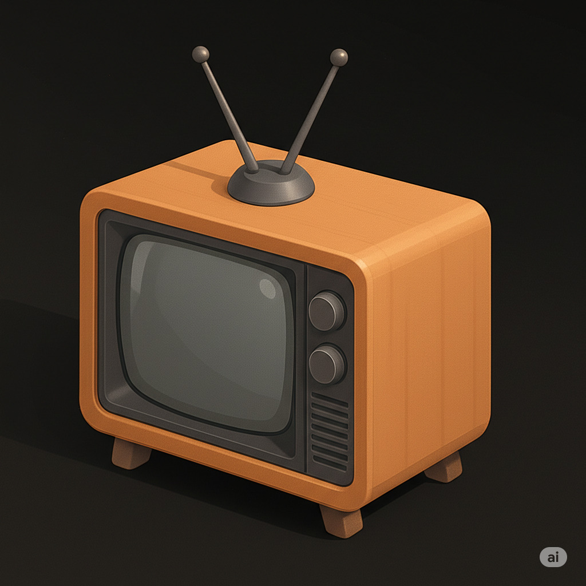
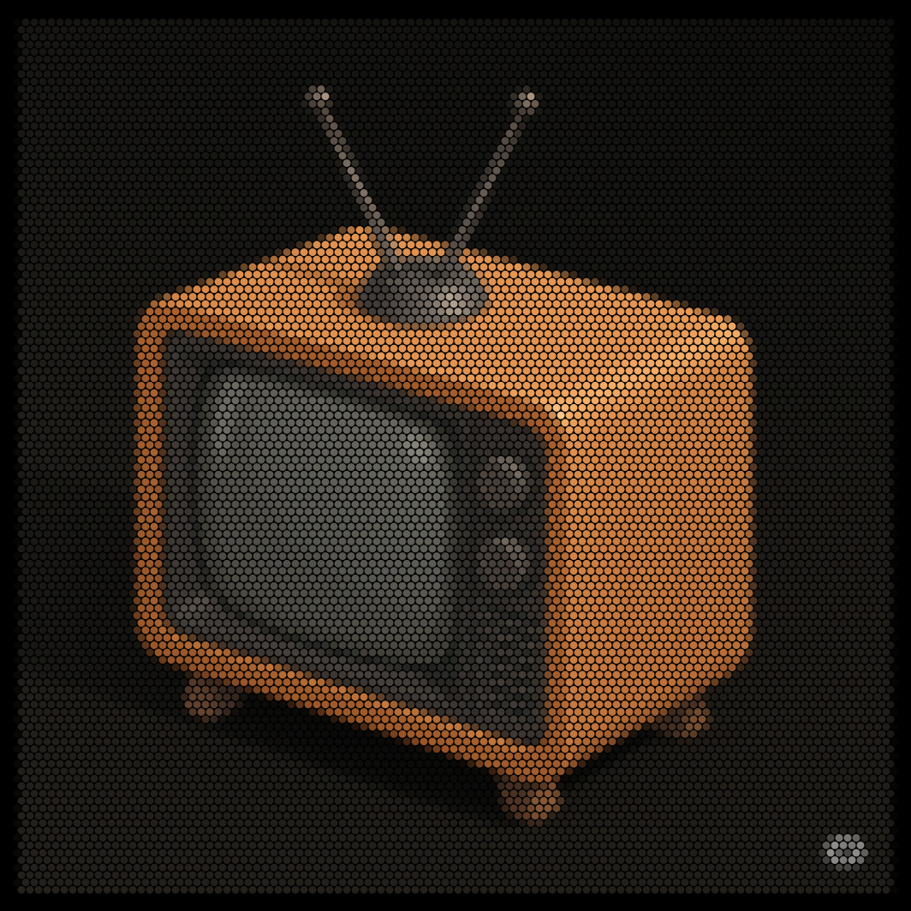
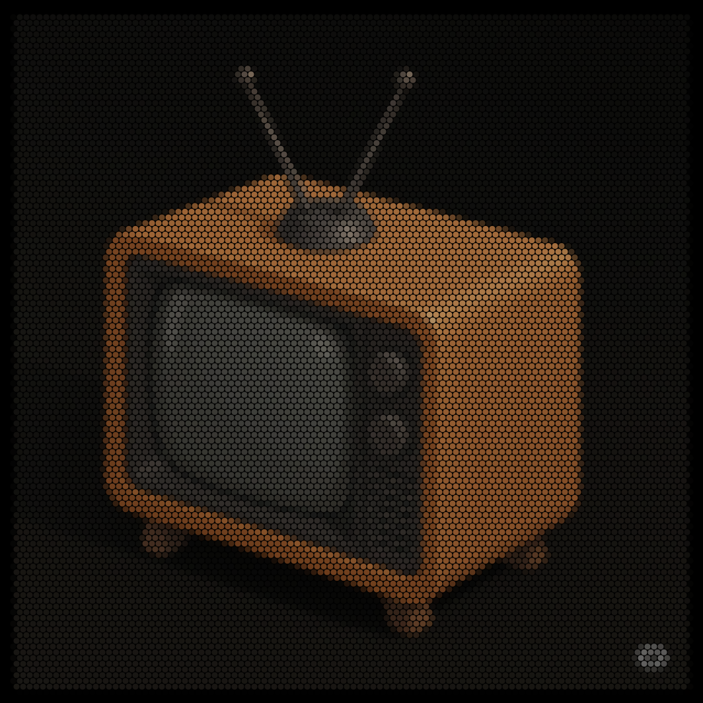
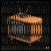

# Pixelator App: Your Browser-Based Image Pixelation Tool

The Pixelator App is a straightforward and intuitive web application designed to help you transform any image into a unique pixel art representation directly within your browser. Forget complex software – simply upload an image or provide a URL, adjust the pixelation level, and instantly see your photos rendered in a blocky, retro style.

Whether you're looking to create nostalgic pixel art, experiment with abstract image effects, or simplify complex visuals, the Pixelator App provides quick and easy controls.

## Sample

### Source Image

### Pixelated Image PNG

### Pixelated Image SVG

### Pixelated Image ICO

---

## ✨ Features

- **Image Input:** Seamlessly upload images from your device or load them directly from a web URL.
- **Customizable Pixelation:** Adjust the primary pixel density to control the level of detail.
- **Diverse Patterns:** Choose from various tessellation patterns like Grid, Hexagonal, and Triangular.
- **Shape Variety:** Select different pixel shapes, including Square, Circle, Triangle, and Hexagon.
- **Color Control:** Limit the number of colors in your palette and apply dithering algorithms (Floyd-Steinberg, Atkinson, Ordered) for unique visual effects.
- **Edge Outlines:** Add customizable outlines to your pixel shapes for a distinct look.
- **Real-time Preview:** See changes applied instantly as you adjust settings.
- **Flexible Output:** Download your pixelated creations as high-quality PNG images, scalable SVG vector graphics, or compact ICO files.

---

## 🚀 How to Use

1.  **Load an Image:**
    - **From Device:** Click the "Upload from Device" area or drag and drop an image file.
    - **From URL:** Paste a direct image URL into the "Load from Web URL" field and click "Load Image".
    - **Example Image:** Click "Load Example" to quickly try out the app with a default image.
2.  **Adjust Settings:** Use the controls in the right sidebar to customize:
    - **Image Margin:** Add padding around your image.
    - **Aspect Ratio:** Crop your image to specific ratios or keep the original.
    - **Pixel Density & Style:** Change the size, pattern, and shape of your pixels.
    - **Color Palette:** Limit colors and apply dithering for a retro feel.
    - **Edge Outline:** Add borders to your pixels.
3.  **Process Image:** Click the "Process Image" button to apply all selected settings. If "Real-time Preview" is enabled, changes will apply automatically.
4.  **Toggle View:** Use "Show Original" / "Show Processed" to switch between the original and pixelated versions.
5.  **Download:** Once satisfied, click the `.png`, `.svg`, or `.ico` buttons to download your pixelated image.

---

## 🌐 Live Demo

[Link to Live Demo (Coming Soon!)](https://davidtiberias.github.io/pixelator-app/)

---

## 📄 License

This project is licensed under the MIT License - see the [LICENSE](LICENSE) file for details.
